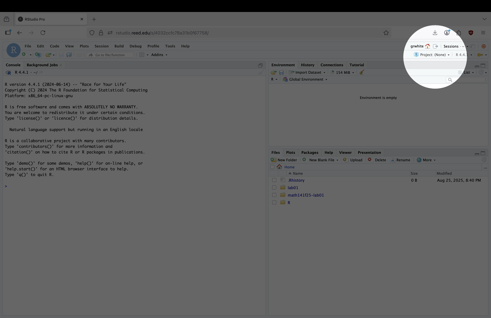
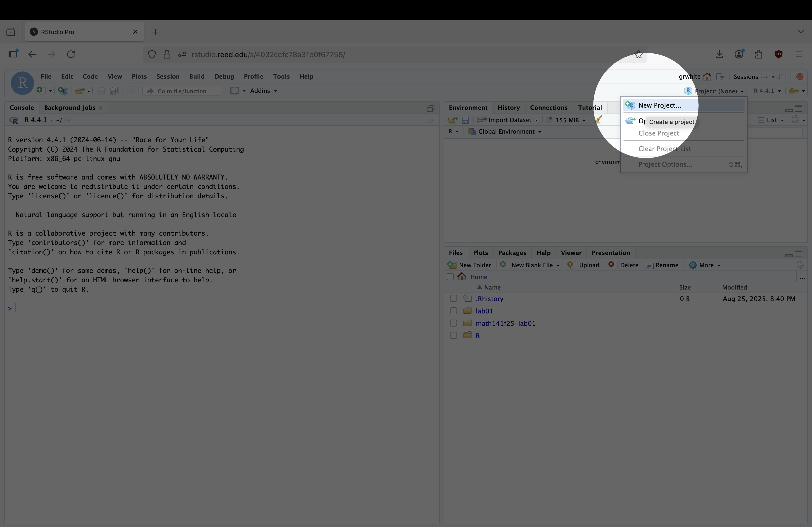
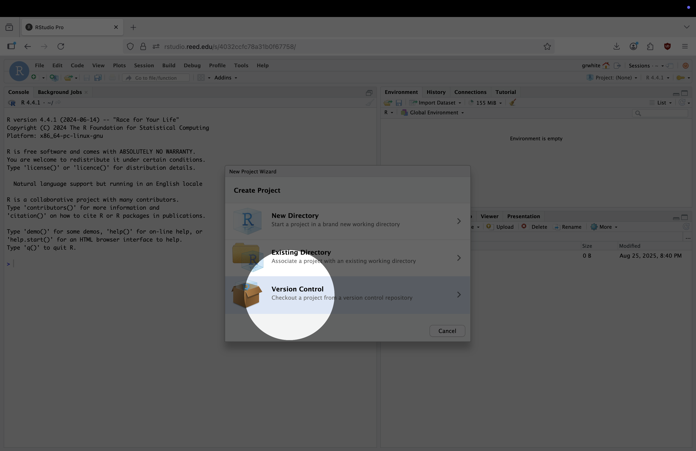
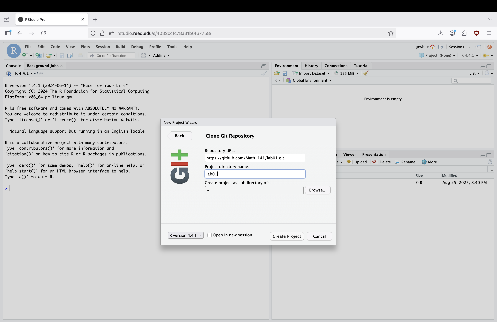
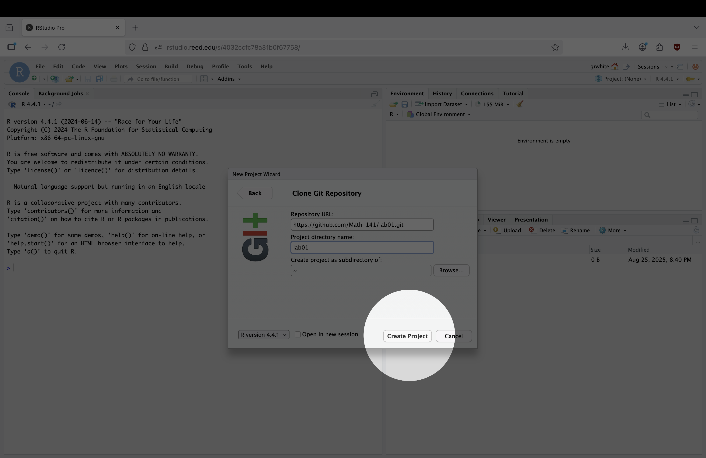
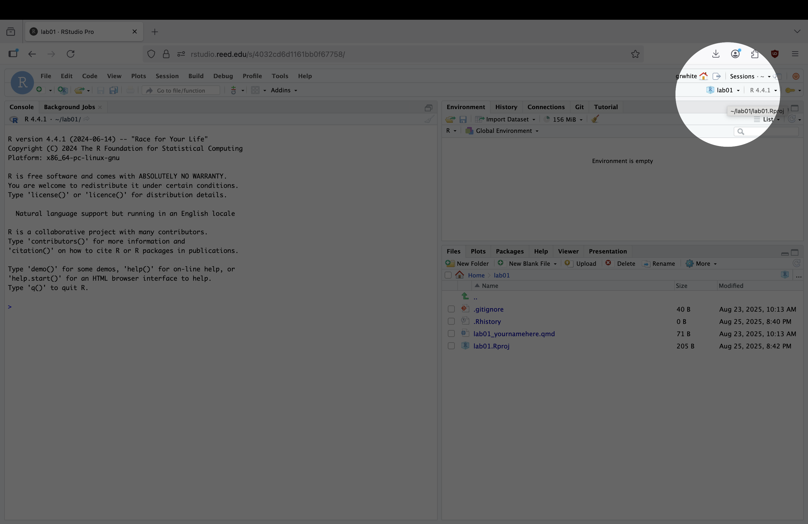
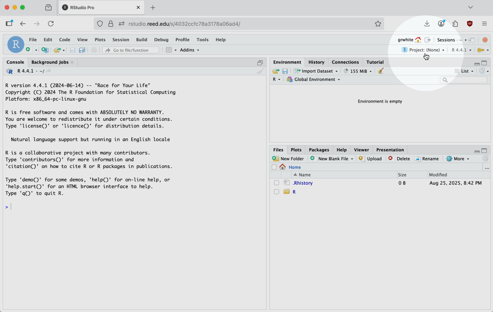

## Accessing this Lab

In order to access the lab each week, you'll have to follow these steps. Here, we detail the process of opening RStudio and "cloning" a GitHub repository to get the lab materials. "Cloning", in this case, means making a copy of my a folder I've uploaded with all files and data needed so that you can complete the lab. Anyways, here are the steps: 

1. Open RStudio.
2. In the Projects dropdown (typically upper right) of RStudio, click the "Project: (None)" button[^1]. Then, click "New Project...". 

[^1]: If you're already in a project, this button will show that projects name. This shouldn't be the case for the first lab, but will likely be the case for the remaining labs. 

:::: {.columns}

::: {.column width="45%"}

:::

::: {.column width="10%"}

:::

::: {.column width="45%"}

:::

::::

4. A pop-up will appear to ask how you'd like to create the project. You'll need to click "Version Control" and the "Git" to access the lab materials. After you've clicked "Version Control" and "Git", add the link to the lab materials in the "Repository URL" section:[^2] 

    **https://github.com/stat-243-f26/lab01.git**
    
    Finally, give the Project Directory the name "lab01"

[^2]: This link will always be the same, but updated for the lab number, e.g. [https://github.com/stat-243-f26/lab02.git](https://github.com/stat-243-f26/lab01.git) for lab 2, [https://github.com/stat-243-f26/lab10.git](https://github.com/stat-243-f26/lab01.git) for lab 10, etc. You won't be able to access these projects until the day that the lab is released, though. 

:::: {.columns}

::: {.column width="45%"}

:::

::: {.column width="10%"}

:::

::: {.column width="45%"}

:::

::::

5. Press "Create Project". If all has gone well, you should see "lab01" in the top right corner of RStudio, and some new files for the lab in the bottom right corner of RStudio. 

:::: {.columns}

::: {.column width="45%"}

:::

::: {.column width="10%"}

:::

::: {.column width="45%"}

:::

::::

6. Open `lab01_yourname.qmd`. This is the Quarto document that you'll complete the lab in. You can (and should) rename this file to include your actual name by checking the box next to the file, clicking "Rename", and modifying the text to include your name, e.g. `lab01_graysonwhite.qmd`, rather than `lab01_yourname.qmd`. 

We've also provided a gif of steps 3-6 to help minimize confusion in these steps: 

