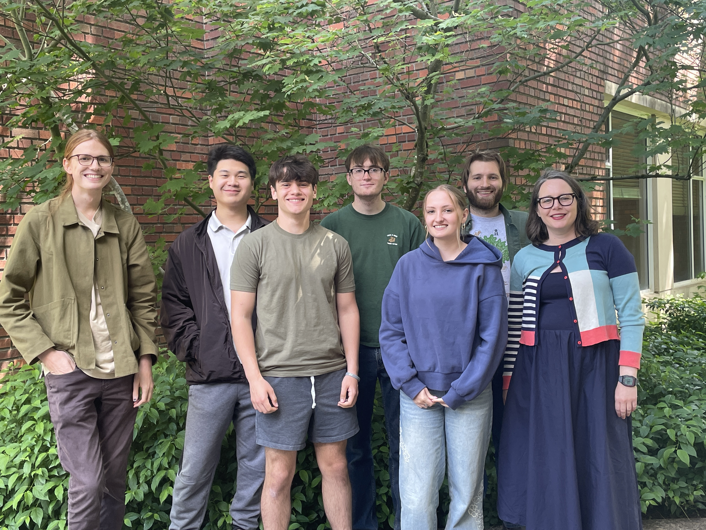
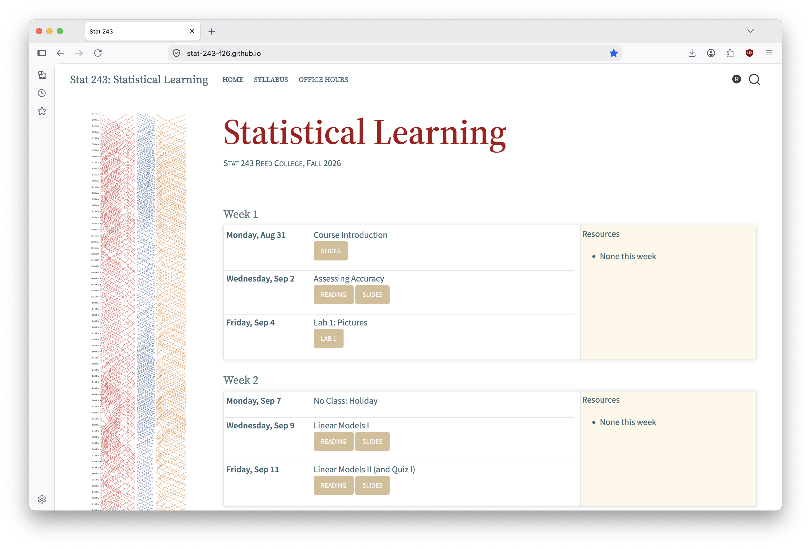
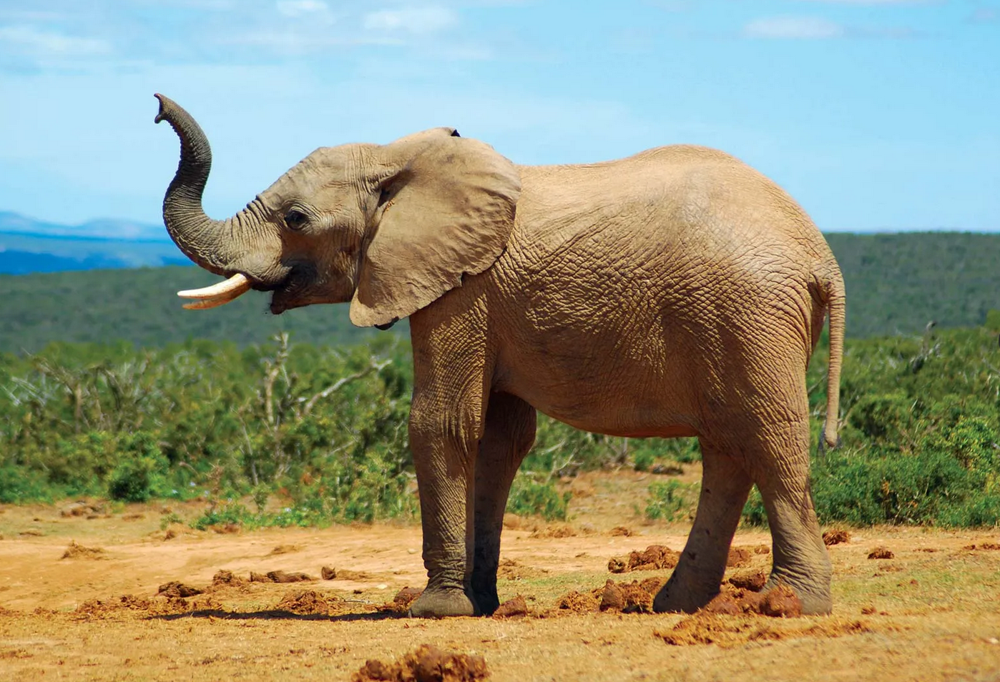

```{r}
#| include: false
#| warning: false
#| message: false

knitr::opts_chunk$set(echo = TRUE, warning = FALSE, message = FALSE,
                      fig.retina = 3, fig.align = 'center')
library(knitr)
library(tidyverse)
```

::::: columns
::: {.column .center width="60%"}
{width="90%"}
:::

::: {.column .center width="40%"}
<br>

[Intro to Statistical Learning]{.custom-title}

<br> <br> 

[Grayson White]{.custom-subtitle}

[Stat 243 <br> Week 1 \| Fall 2026]{.custom-subtitle}
:::
:::::

------------------------------------------------------------------------


## Goals for Today (and next time)

:::: {.columns}

::: {.column width='50%'}

::: {.nonincremental .fragment}

**Today:**

-   Getting started in Stat 243
    - Course structure and technologies
    - Where to find resources 
    - Course expectations

:::

:::

::: {.column width='50%'}

::: {.nonincremental .fragment}

**Wednesday:**

-   Assessing accuracy


:::

:::

::::


# But first, let me quickly introduce myself...

...and after that I'll have each of you introduce yourselves `r emo::ji("smile")`

## My info {.center}

<br>

::: {.fragment .fade-up .midi .nonincremental}


- **Name**: Grayson White (he/him), you can call me 'Grayson'

- **Email**: [gwhite@reed.edu](mailto:gwhite@reed.edu)

- **Office**: Library 386

- **Office hours**: TBD, please fill out the [office hours survey](https://whenisgood.net/y2zt3a2) ASAP for your availability to be considered.
    -   This week, I'll hold office hours on Tuesday 1pm - 3pm and Friday 9am - 10:30am, or by appointment.


:::


------------------------------------------------------------------------


### Let's start with my path (back) to Reed...

```{r, echo = FALSE, dev.args = list(bg = 'transparent'), fig.asp = .6, out.width = '80%'}
library(tidyverse)
library(shadowtext)

MainStates <- map_data("state")

ggplot() +
  geom_polygon(
    data = MainStates,
    aes(x = long, y = lat, group = group),
    
    color = "white",
    fill = "#7E8A65",
    size = 1.25
  ) +
  theme_void() +
  geom_shadowtext(
    aes(
      x = -111.8881,
      y = 40.7606,
      label = "Forest Service"
    ),
    color = "white",
    size = 5,
    bg.color = "#7E8A65"
  ) +
  geom_shadowtext(
    aes(
      y = 45.523064 - 0.5,
      x = -122.676483 + 1,
      label = "Reed College"
    ),
    color = "white",
    size = 5,
    bg.color = "#7E8A65"
  ) +
  geom_shadowtext(
    aes(
      y = 42.7336,
      x = -84.5539,
      label = "Michigan State\nUniversity"
    ),
    color = "white",
    size = 5,
    bg.color = "#7E8A65"
  ) + 
  geom_segment(aes(x = -122.676483 + 1, y = 45.523064 - 0.5,
                   xend = -111.8881, yend = 41.5),
               color = "red", arrow.fill = "red",
    arrow = arrow(type = "closed")) +
    geom_segment(aes(xend = -116.5, yend = 45.523064 - 0.5,
                   x = -90, y = 42.7),
               color = "red", arrow.fill = "red",
    arrow = arrow(type = "closed")) +
    geom_segment(aes(xend = -90, yend = 42.7,
                   x = -106, y = 40.7606),
               color = "red", arrow.fill = "red",
    arrow = arrow(type = "closed")) +
  theme(legend.position = "none")
```

------------------------------------------------------------------------

## Research Interests {.center}

::: {.fragment .fade-up .midi}

#### Statistical modeling with environmental applications 


:::

------------------------------------------------------------------------

## Research Interests {.center}

#### Advising Undergraduate Forestry Data Science Research

::: {.fragment .fade-up .midi}

{width=60%}

:::


# Introductions!

Would love to hear: your name, pronouns, major, what you're excited about in this class, and a fun fact! 


## What is 243?

This course will:

::: {.nonincremental}

- **In a nutshell:** Expand your "toolbox" for analyzing large, modern, and complex data

:::

::: {.fragment .nonincremental}

- Cover important modeling and predictive techniques (e.g., regression, classification, clustering, tree-based methods, neural networks)

- Practice each method in `R` using real/simulated data

See syllabus for more detailed learning outcomes

:::


## Getting Started in Stat 243


#### Course website

:::: {.columns}

::: {.column width="70%"}



:::


::: {.column width="30%"}

-   The course website, [stat-243-f26.github.io](https://stat-243-f26.github.io/), will be the central location for all our course materials. 

-   We'll also use some other technologies and resources for collaboration, dissemination, and communication.

:::

::::


------------------------------------------------------------------------

## Getting Started in Stat 243

#### Other Resources 

<br>

::: {.fragment .fade-up .midi}

Reed's **RStudio Server** or a **local installation of RStudio**, for completing coursework,

:::

<br>

::: {.fragment .fade-up .midi}

A course-wide **Slack** workspace, for course communication,

:::

<br>

::: {.fragment .fade-up .midi}

**Gradescope**, for turning in assignments and exams, and

:::

<br>

::: {.fragment .fade-up .midi}

**Our course GitHub organization**, for collaboration, portfolio-building, and dissemination of work. 

:::


# Let's take a look at the course website...

**[stat-243-f26.github.io](https://stat-243-f26.github.io/)**


# What is Stat Learning?

## Example: Loan Default

A **bank** wants to model the **probability customers default on a loan**

::: {.nonincremental}

Common Considerations:

  + Customer age

  + Marital status

  + Income

:::

::: {.fragment .nonincremental}

**Q:** What other factors might a bank consider?

**Q:** How might each factor relate to probability of default?

**Q:** What ethical problems might be present?

:::

## The Setting

Let:

::: {.nonincremental}

  - $Y$ be a **"response variable"** (e.g., prob of default)
  - $X_1, \dots , X_p$ be $p$ **"predictor variables"** (e.g., age, marital status, income)

:::

::: {.fragment .nonincremental}

**Stat Learning:** the study of the relationships between predictors ($X_1, \dots , X_p$) and a response ($Y$)

  - (Sometimes we study the relationship among *only* predictors)

:::

## Models

We usually assume there is a relationship between predictors and response:

$$
Y = \underbrace{f(X_1, \dots, X_p)}_{\text{function of predictors}} + \underbrace{\epsilon}_{\text{"error"}}
$$

where $\epsilon$ **("epsilon")** is a random **error** (more on this later!)

**Example: Linear regression!**

$$\text{Default Prob} = \beta_0 + \beta_1\text{(Age)}+\beta_2\text{(Married)} + \beta_3\text{(Income)} + \epsilon$$

::: {.fragment .nonincremental}

**The goal of stat learning is to estimate $f$**, given data on $X$ and $Y$.

  - $f$ captures the "relationship" between $X$ and $Y$

:::

## Types of Statistical Learning

It's helpful to distinguish different types of statistical learning.

::: {.fragment .nonincremental}

On the next 4 slides, I'll contrast the following 4 pairs of terms:

1. Prediction vs. Inference Tasks

2. Parametric vs. Non-Parametric Methods

3. Supervised vs. Unsupervised Learning

4. Regression vs. Classification Problems

:::

## Prediction vs. Inference

::: {.nonincremental}

1) **Prediction**

    - Goal: Use a model to make predictions for *new* data
    - Example: Predict probability of default for a new customer

::: {.fragment .nonincremental}

2) **Inference**

    - Goal: Understand relationships among predictors/response
    - Example: What's the general relationship between age and loan default?
    - Example: Is marital status an important predictor of loan default?

:::

:::

## Parametric and Non-Parametric Methods

::: {.nonincremental}

1) **Parametric Methods**

    - Make assumptions about form of $f$ using **parameters**

    - Example: Linear regression
    $$f(X) = \beta_0 + \beta_1X_1+\dots+\beta_pX_p$$
    where $\beta_0,\beta_1,\dots,\beta_p$ are **parameters**

::: {.fragment .nonincremental}

2) **Non-Parametric Methods**

    - **Forgo assumptions** on the shape of $f$

    - Examples: Neural networks, "nearest neighbor" algorithms

    - **Problems:** Require much more data, uninterpretable, not generalizable *(more on this later!)*

:::

:::

## Supervised vs. Unsupervised Learning

::: {.nonincremental}

1) **Supervised Learning**

    - Models with response variable (and predictors!)

    - Example: Predicting default risk using age

::: {.fragment .nonincremental}

2) **Unsupervised Learning**

    - Models with *no* response variables

    - Cluster or detect pattern among observations

    - Example: Create "social groups" among bank customers using age and income (such as "wealthy Millenials", "low-income retirees", etc.)

:::

:::

## Regression vs. Classification Problems

::: {.nonincremental}

1) **Regression Problems**

    - Models with **quantitative** response variables

    - Example: Model probability of wildfire by temperature

::: {.fragment .nonincremental}

2) **Classification Problems**

    - Models with **qualitative** response variables or outputs

    - Example: Predict if there will/won't be a wildfire by temperature

:::

:::


# Now, let's discuss course structure and policies


## Class Time

::: {.nonincremental}

**Lecture:** Mondays and Wednesdays

  - Complete a reading before each "lecture" from one of our textbooks, [An Introduction to Statistical Learning in R (ISLR)](https://www.statlearning.com), or [Beyond Multiple Linear Regression (BMLR)](https://bookdown.org/roback/bookdown-BeyondMLR/).
  
  - Occasionally, I might assign a blog post or reading from a different (free, online) textbook. 

  - **Our textbooks are free online! See the syllabus!**

:::

::: {.fragment .nonincremental}

**Lab:** Fridays

  - Practice course content, work on assignments, and take short quizzes on past material.

  - Mix of pen-and-paper work, coding activities.
  
  - Typical Friday workflow: start with a brief quiz on last week's material, then transition to practice of current content.

:::

## Technology

You will need access to a laptop for this course.

::: {.nonincremental}

- **Bring a laptop to class every day**

- **Please let me know ASAP if you do not have access to a personal laptop!**

:::

::: {.fragment .nonincremental}

We will regularly use the `R` programming language

- All assignments will be completed in `RStudio`

- `RStudio` can be downloaded to your computer (see syllabus) or accessed on the Reed `RStudio` Server: [https://rstudio.reed.edu/](https://rstudio.reed.edu/)

:::

------------------------------------------------------------------------


## Assignments and projects {.smaller}


::: {.nonincremental}

:::: {.columns}

::: {.column width="45%"}

::: {.fragment .fade-up}

-   **Labs (*weekly-ish*)**
    - Assigned Friday at class time. 
    - Due the following Friday on Gradescope before class.
    - Graded for **completion** and **effort**.
    - Planning on 10 labs. Subject to change by $\pm$ 1 lab.
    - Each week, we will have a quiz, graded for **correctness** on the past week's lab.
    
:::


::: {.fragment .fade-up}

-   **Final Project**
    - The proposal for the final project will be due before fall break.
    - More info to come!
    
:::


::: {.fragment .fade-up}

-   **Final Exam**
    - We will have a final exam during finals week.
    
:::

:::

::: {.column width="10%"}

:::

::: {.column width="45%"}

::: {.fragment .fade-up}

-   **In-class activities (*semi-regular*)**
    - Individual activities.
    - Group activities.
    
:::

<br> <br>

::: {.fragment .fade-up}


-   **Attendance and active participation**
    - Is key to your learning! 
    - Please participate in class and in Slack. 
    - And will be considered in your final grade. 
    - Let me know if you cannot make it to class for health reasons or otherwise! If you are experiencing extenuating circumstances that inhibit your ability to attend I will work with you to help you succeed in the class. Communication is key. 
    
:::

:::


::::

:::


## Late Work

::: {.nonincremental}

:::{.fragment .fade-up}

-   **Labs**: up to 4 extensions days can be used throughout the semester.
    - e.g., 1 additional day for 4 labs, 4 additional days for 1 lab, ...
    - rounding days up
    - **But**! You may not delay the quiz if you are using extension days.
    
:::

:::{.fragment .fade-up}

-   **Projects**: no late projects are accepted.

:::

:::{.fragment .fade-up}

-   **In-class assignments**: cannot be made up.

:::

:::{.fragment .fade-up}

-   **Final exam**: cannot be made up.

:::


:::{.fragment .fade-up}

-   **Quizzes**: cannot be made up, but if you will have a planned absence for a Friday or are ill, email me **beforehand** and we can discuss possible solutions for taking a quiz.  

:::

:::


## Course Climate 

::: blockquote

We expect everyone in this class to strive to foster a learning environment that is equitable, inclusive, and welcoming. If you experience any barriers to learning, please come to Professor Grayson White or a college administrator with your concerns.

<br>

**Code of Conduct**:


We expect all members of Stat 243 to make participation a harassment-free experience for everyone, regardless of age, body size, visible or invisible disability, ethnicity, sex characteristics, gender identity and expression, level of experience, education, socio-economic status, nationality, personal appearance, race, religion, or sexual identity and orientation.

We expect everyone to act and interact in ways that contribute to an open, welcoming, inclusive, and healthy community of learners. You can contribute to a positive learning environment by demonstrating empathy and kindness, being respectful of differing viewpoints and experiences, and giving and gracefully accepting constructive feedback.[^1]

[^1]: This Code of Conduct is adapted from the [Contributor Covenant](https://www.contributor-covenant.org/version/2/0/code_of_conduct.html), version 2.0.

:::

```{r}
#| echo: false
countdown::countdown(1)
```


## Engagement

::::: columns
::: {.column width="50%"}
<br> <br>

{width="90%" fig-align="center"}

-   Being **actively present** is key.
:::

::: {.column width="50%"}
-   During lecture and lab, remove distractions.
    -   When we are on our computers, close email, social media, news, etc.
    -   Hide your phone.
-   I have high expectations but know that all of you (regardless of your stats, math, or computing background) have the ability to meet them.
:::
:::::


## Artificial Intelligence (AI) Policy


::: blockquote

Artificial intelligence (AI) tools, such as ChatGPT, Claude, Co-Pilot, Gemini, and others are being used to generate code, analyze data, write, and much more (and they are getting quite good at many of these tasks!). However, learning to think critically about a problem at hand, and engaging with your peers, tutors, and instructors when not understanding a concept or question are integral components of a liberal arts education and goals of this course. Therefore, 

**For all course content**: The use of generative AI tools, such as ChatGPT and others, are strictly prohibited in any stage of the work process for this course.

:::

```{r}
#| echo: false
countdown::countdown(1)
```


## Why this policy?


::: {.fragment}

- Relying too heavily on AI tools to think for you, and to write your code prohibits understanding of the core concepts. 

:::

::: {.fragment}

**My goal:** Make you an excellent statistician / data scientist / machine learning guru / ... with a great deal of personal understanding of the material so that you can... 

  - independently engage with statistical learning methods, 
  - ethically engage with sensitive data, and
  - continue to embrace and engage in the very human aspects of statistical learning.

:::

# Questions? 

About the syllabus, AI, the course, etc.?


## Next Time

- An activity
- A deeper introduction to stat learning


