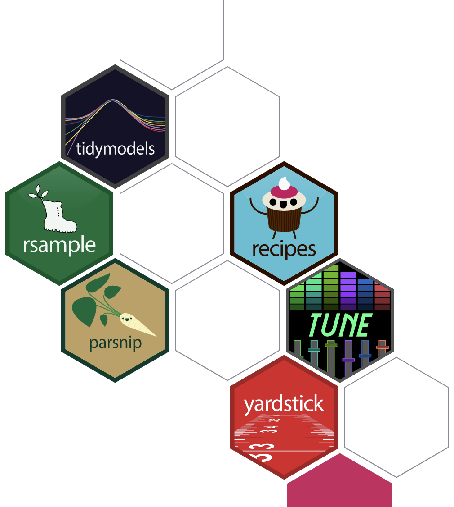
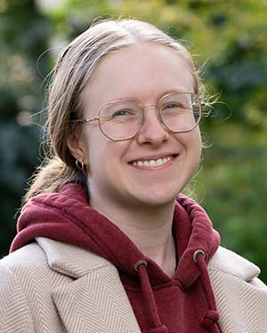
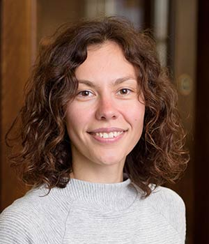

```{r}
#| include: false
#| warning: false
#| message: false

knitr::opts_chunk$set(echo = TRUE, warning = FALSE, message = FALSE,
                      fig.retina = 3, fig.align = 'center')
library(knitr)
library(tidyverse)
```

::::: columns
::: {.column .center width="60%"}
{width="90%"}
:::

::: {.column .center width="40%"}
<br>

[How old are we?]{.custom-title}

<br> <br> 

[Grayson White]{.custom-subtitle}

[Stat 243 <br> Week 1 \| Fall 2026]{.custom-subtitle}
:::
:::::

------------------------------------------------------------------------


## Goals for Today (and next time)

:::: {.columns}

::: {.column width='50%'}

::: {.nonincremental .fragment}

**Today:**

-   Guess the age of Reed math / stats / cs faculty
-   Start to think about quantifying error
:::

:::

::: {.column width='50%'}

::: {.nonincremental .fragment}

**Friday (lab):**

-   Technologies, Data, and Stat Learning Methods


:::

:::

::::


## Before we get started: Pre-lab assignment

Before Thursday 9/3 (tomorrow) at noon, please do the following:

<br> <br>

::: {.blockquote .fragment}

We'll use GitHub for our class, so each of you need to have a GitHub profile. If you don't have a GitHub profile already, go to [https://github.com/](https://github.com/) and sign up for one. Once you've signed up for an account, please add it to the [Google Sheet](https://docs.google.com/spreadsheets/d/1yhQfUwGpKj1bQYg3rmDybKobVkh-tjnY-GcYn4LTf7c/edit?usp=sharing) so that I can add you to the stat-243-f26 organization. Note: you'll need to be logged in to your Reed Google account to edit the Google Sheet.

:::

# How Old Are We?

## The Rules

I will display photos from 8 current and former math/stats faculty:

::: {.nonincremental}

  - **Goal:** Estimate the age of each faculty member (at the time the picture was taken)
  - **Note:** None of these pictures were taken this year!

:::

::: {.fragment .nonincremental}

Work **in groups of 2-3** to develop a consistent method for estimating age.

Record your estimates for each faculty member on paper and submit it to me.

:::

## Photo 1

```{r}
#| echo: false
#| fig-align: "center"
#| out-width: "50%"

```

## Photo 2

```{r}
#| echo: false
#| fig-align: "center"
#| out-width: "40%"

```

## Photo 3

```{r}
#| echo: false
#| fig-align: "center"
#| out-width: "40%"

```

## Photo 4

```{r}
#| echo: false
#| fig-align: "center"
#| out-width: "40%"

```

## Photo 5

```{r}
#| echo: false
#| fig-align: "center"
#| out-width: "40%"

```

## Photo 6

```{r}
#| echo: false
#| fig-align: "center"
#| out-width: "40%"

```

## Photo 7

```{r}
#| echo: false
#| fig-align: "center"
#| out-width: "40%"

```

## Photo 8

```{r}
#| echo: false
#| fig-align: "center"
#| out-width: "40%"

```

## All Photos

As we wait for groups to guess ages, complete the reflection worksheet.

:::: {.columns}

::: {.column width='25%'}


```{r}
#| echo: false
#| fig-align: "center"
#| out-width: "100%"

```


```{r}
#| echo: false
#| fig-align: "center"
#| out-width: "100%"

```

:::

::: {.column width='25%'}

```{r}
#| echo: false
#| fig-align: "center"
#| out-width: "70%"

```

```{r}
#| echo: false
#| fig-align: "center"
#| out-width: "70%"

```

:::

::: {.column width='25%'}


```{r}
#| echo: false
#| fig-align: "center"
#| out-width: "72%"

```


```{r}
#| echo: false
#| fig-align: "center"
#| out-width: "72%"

```

:::

::: {.column width='25%'}


```{r}
#| echo: false
#| fig-align: "center"
#| out-width: "73%"

```


```{r}
#| echo: false
#| fig-align: "center"
#| out-width: "73%"

```


:::


::::

# Questions

## Reflection: Modeling Questions

::: {.nonincremental}

- What explicit features are you analyzing?
- How do you convert these features to numerical estimates?
- How do you resolve differences in opinion among group members?

:::


## Reflection: Definitional Questions

::: {.nonincremental}

- Is the activity **supervised** or **unsupervised**? 
    - [Supervised]{.fragment}
- Does it represent a **classification** or **regression** problem? 
    - [Regression]{.fragment}
- Are you interested primarily in **prediction** or **inference**? 
    - [Prediction]{.fragment}
- Are you using **parametric** or **non-parametric** methods? 
    - [Either would have worked!]{.fragment}

:::


## Reflection: Conceptual Questions


::: {.nonincremental}

- What are some sources of "error" in your estimates?
- How can we quantify the error in your estimates?
- How should we assess the overall accuracy of a group's predictions?
- In what other circumstances do people (or companies, or algorithms) predict age based on photos or physical appearance? Is that ethical?

:::

# Results

(on the board)


## Returning to conceptual questions

::: {.nonincremental}

- What are some sources of "error" in your estimates?
- How can we quantify the error in your estimates?
- How should we assess the overall accuracy of a group's predictions?
- In what other circumstances do people (or companies, or algorithms) predict age based on photos or physical appearance? Is that ethical?

:::


## Next Time

- Lab 1: *Technologies, Data, and Stat Learning Methods*
    
::: {.fragment .nonincremental}
    
- Remember, before Thursday 9/3 (tomorrow) at noon, please do the following:

::: {.blockquote}

We'll use GitHub for our class, so each of you need to have a GitHub profile. If you don't have a GitHub profile already, go to [https://github.com/](https://github.com/) and sign up for one. Once you've signed up for an account, please add it to the [Google Sheet](https://docs.google.com/spreadsheets/d/1yhQfUwGpKj1bQYg3rmDybKobVkh-tjnY-GcYn4LTf7c/edit?usp=sharing) so that I can add you to the stat-243-f26 organization. Note: you'll need to be logged in to your Reed Google account to edit the Google Sheet.

:::

:::


