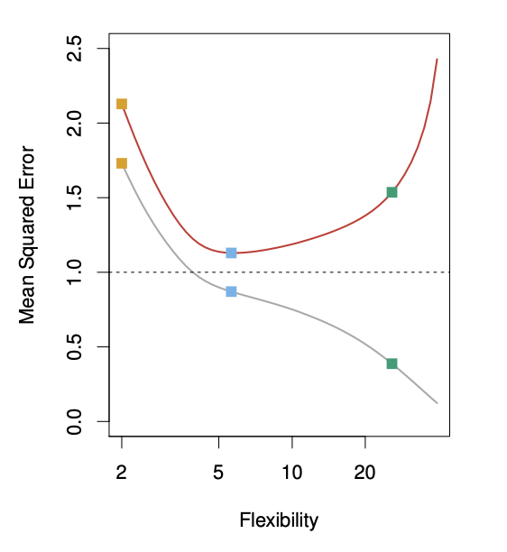

```{r}
#| include: false
#| warning: false
#| message: false

knitr::opts_chunk$set(echo = TRUE, warning = FALSE, message = FALSE,
                      fig.retina = 3, fig.align = 'center')
library(knitr)
library(tidyverse)
library(palmerpenguins)
```

::::: columns
::: {.column .center width="60%"}
{width="90%"}
:::

::: {.column .center width="40%"}
<br>

[Assessing Accuracy]{.custom-title}

<br> <br> 

[Grayson White]{.custom-subtitle}

[Stat 243 <br> Week 2 \| Fall 2026]{.custom-subtitle}
:::
:::::

------------------------------------------------------------------------


## Goals for Today (and next time)

:::: {.columns}

::: {.column width='50%'}

::: {.nonincremental .fragment}

**Today:**

-   Formalize how we think about assessing accuracy.

:::

:::

::: {.column width='50%'}

::: {.nonincremental .fragment}

**Friday (*NOT* lab):**

-   Linear regression.


:::

:::

::::


# How Old Are We?

## The Rules

I will display photos from 8 current and former math/stats faculty:

::: {.nonincremental}

  - **Goal:** Estimate the age of each faculty member (at the time the picture was taken)
  - **Note:** None of these pictures were taken this year!

:::

::: {.fragment .nonincremental}

Work **in groups of 2-3** to develop a consistent method for estimating age.

Record your estimates for each faculty member on paper and submit it to me.

:::


## All Photos

As we wait for groups to guess ages, complete the reflection worksheet.

:::: {.columns}

::: {.column width='25%'}


```{r}
#| echo: false
#| fig-align: "center"
#| out-width: "100%"
include_graphics("img/Faculty_Img/megan-23.jpeg")
```


```{r}
#| echo: false
#| fig-align: "center"
#| out-width: "100%"
include_graphics("img/Faculty_Img/Wainstein-color.png")
```

:::

::: {.column width='25%'}

```{r}
#| echo: false
#| fig-align: "center"
#| out-width: "70%"
include_graphics("img/Faculty_Img/chris.jpg")
```

```{r}
#| echo: false
#| fig-align: "center"
#| out-width: "70%"
include_graphics("img/Faculty_Img/marcus-17.jpg")
```

:::

::: {.column width='25%'}


```{r}
#| echo: false
#| fig-align: "center"
#| out-width: "72%"
include_graphics("img/Faculty_Img/alex.jpg")
```


```{r}
#| echo: false
#| fig-align: "center"
#| out-width: "72%"
include_graphics("img/Faculty_Img/michael.jpg")
```

:::

::: {.column width='25%'}


```{r}
#| echo: false
#| fig-align: "center"
#| out-width: "50%"

```


```{r}
#| echo: false
#| fig-align: "center"
#| out-width: "50%"
include_graphics("img/Faculty_Img/img3.jpg")
```


:::


::::

# Mean Squared Error

## Running Example: Adelie Penguins

We want to **predict** Body Mass ($Y$) based on Bill Length ($X$), based on a sample of $n=50$ Adelie penguins.

```{r}
#| fig-asp: .4
set.seed(0)
adelie <- penguins %>% filter(species=="Adelie")
which_train <- sample(1:nrow(adelie),50)
adelie <- adelie[which_train,]
ggplot(adelie,aes(x=bill_length_mm,y=body_mass_g))+geom_point() +theme_bw(base_size=18) +
  labs(title="Sample of n=50 Adelie Penguins",x="Bill Length",y="Body Mass")
```
*Note: This is prediction, supervised learning, and a regression problem*

**Q:** How would you model this relationship? (*Parametric vs. Non-Parametric?*)

## Types of Error

There are two sources of error in a **model**,
$$
\hat{Y} = \hat{f}(X)
$$
for the **true relationship**,
$$
Y = f(X)+\epsilon
$$

$$
  \text{Error} = Y - \hat{Y} = \underbrace{(f - \hat{f})}_{\text{Reducible}} + \underbrace{\epsilon}_{\text{irreducible}}
$$

::: {.fragment .nonincremental}

1. **Reducible error:** in the form of our estimate $\hat{f}$ for $f$.

2. **Irreducible error:** in the form of $\epsilon$

:::

::: {.fragment .nonincremental}

+ We usually lower Reducible error by **increasing the sample size**

+ We usually **cannot** lower Irreducible error

:::

## Quality of a Model

When given a modeling question, we can conceive of **many possible models**.

::: {.fragment .nonincremental}

How do we measure **quality of a model?**

1) Devise a quantitative measurement of model error.

2) Select the model that minimizes this measure of error.

:::

::: {.fragment .nonincremental}

For regression, the most common measure of error is the **Mean Squared Error** (MSE):
$$
\mathrm{MSE}(\hat{f}) = \frac{1}{n}\sum_{i=1}^n \Big(y_i - \hat{f}(x_i) \Big)^2
$$
where

  - $\hat{f}$ is the model
  - $x_i$ are the observed predictor values
  - $y_i$ are the corresponding observed response values.

:::

## Mean Squared Error (MSE)

$$
\mathrm{MSE}(\hat{f}) = \frac{1}{n}\sum_{i=1}^n \Big(y_i - \hat{f}(x_i) \Big)^2
$$

**Q:** Under what circumstances is MSE small?

::: {.fragment .nonincremental}

  - When the (reducible + irreducible) error  is small!

  - **A:** Reducible error (usually) lowers as $n$ increases

:::

::: {.fragment .nonincremental}

**Q:** What could go wrong if we try to minimize $\mathrm{MSE}$ on observed data?

  - Hint: Consider prediction with new penguins

:::

::: {.fragment .nonincremental}

  - **A:** We could make a model *too specific* to our *observed* data that doesn't generalize to *new* data (i.e., **overfitting**)

:::

## Training and Test Data (for prediction problems)

We can solve this problem by dividing our data into **training** and **test** sets.

::: {.fragment .nonincremental}

  - **Training Data**: Subset used for building a model

  - **Test Data**: Rest of data used for assessing model accuracy

:::

::: {.fragment .nonincremental}

If we have training and test data, we can:

  1) Build many models on the training data

  2) Compare their performance on the test data (e.g., compare MSE)

  3) Select the model that did the best on the test data

:::

## Returning to Penguins

We want to predict Body Mass ($Y$) over future penguins based on Bill Length ($X$).

We have a random sample of $n=50$ penguins.

::: {.fragment}

**Q:** How might we split our data into training and test sets?

:::

::: {.fragment .nonincremental}

**A:** Randomly split data in two halves:

  - $n=25$ "training" observations

  - $n=25$ "testing" observations

Let's demonstrate this process!

:::

## Training Set

```{r}
#| echo: false
set.seed(241)
which_train <- sample(1:50,25)
adelie_train <- adelie[which_train,]
adelie_test <- adelie[-which_train,]
```

::: {.smaller}

```{r}
#| echo: true
#| fig-height: 4
#| fig-width: 6
#| out-width: "65%"
#
#
ggplot(adelie_train,aes(x=bill_length_mm,y=body_mass_g))+geom_point() +
  theme_bw(base_size=15) + labs(title="Training Data",x="Bill Length",y="Body Mass")
```

:::

## Model 1 {.smaller}

```{r}
#| echo: true
#| fig-height: 4
#| fig-width: 6
#| out-width: "65%"
#| message: false
ggplot(adelie_train,aes(x=bill_length_mm,y=body_mass_g))+geom_point() +
  theme_bw(base_size=15) + labs(title="Training Data",x="Bill Length",y="Body Mass") +
  geom_smooth( method = "lm" , se = F)
```

## Model 1 and 2 {.smaller}

```{r}
#| echo: true
#| fig-height: 4
#| fig-width: 6
#| out-width: "65%"
#| message: false
ggplot(adelie_train,aes(x=bill_length_mm,y=body_mass_g))+geom_point() +
  theme_bw(base_size=15) + labs(title="Training Data",x="Bill Length",y="Body Mass") +
  geom_smooth( method = "lm" , se = F) +
  geom_smooth( method = "lm" ,formula = y ~ poly(x, 7), se = F, color = "red")
```

## Test Set

```{r}
#| echo: false
#| fig-height: 4
#| fig-width: 6
#| out-width: "80%"
ggplot(adelie_test,aes(x=bill_length_mm,y=body_mass_g))+geom_point() +
  theme_bw(base_size=15) + labs(title="Testing Data",x="Bill Length",y="Body Mass")
```

## Test Set with models {.small}

```{r}
#| fig-height: 4
#| fig-width: 6
#| out-width: "80%"
#| message: false
ggplot(adelie_test,aes(x=bill_length_mm,y=body_mass_g))+geom_point() +
  theme_bw(base_size=15) + labs(title="Testing Data",x="Bill Length",y="Body Mass") +
  geom_smooth(data = adelie_train, method = "lm" , se = F) +
  geom_smooth(data = adelie_train, method = "lm" ,formula = y ~ poly(x, 7), se = F, color = "red")
```

## Test MSE

```{r}
#| echo: false
lin_mod <- lm( body_mass_g ~ bill_length_mm, data = adelie_train)
lin_pred <-predict(lin_mod, adelie_test)
poly_mod <- lm(body_mass_g ~ poly(bill_length_mm, degree = 5), data = adelie_train)
poly_pred <- predict(poly_mod, adelie_test)

get_MSE <- function(actual, pred){mean((actual - pred)^2)}

lin_mse <- get_MSE(adelie_test$body_mass_g, lin_pred)
poly_mse <- get_MSE(adelie_test$body_mass_g, poly_pred)

error <- data.frame(actual = adelie_test$body_mass_g, lin_pred, poly_pred ) %>%
  mutate(lin_sq_error = (actual - lin_pred)^2, poly_sq_error = (actual - poly_pred)^2) %>%
  as_tibble()
```

```{r}
tibble("Linear MSE"=lin_mse, "Polynomial MSE"=poly_mse)
```

**Q:** Which model should we pick? [**A: Linear model, since lower test MSE**]{.fragment}

::: {.fragment}

**Q:** What's actually going on in this situation? **A: The Bias-Variance Trade-off!**

:::

# Bias-Variance Trade-off

## Training vs Test MSE

::: {.nonincremental}

Suppose we consider various models to predict $Y$, each of increasing complexity.

  - What happens to training and test MSE as model complexity increases?

:::

:::: {.columns .fragment}

::: {.column width="60%"}

```{r}
#| fig-align: "center"
#| out-height: "70%"

```

:::

::: {.column width="38%" .nonincremental}

Figure 2.9 from *ISLR*

  - GRAY: Training MSE

  - RED: Test MSE

  - X-axis is model complexity

:::

::::

## MSE Decomposition

U-Curve for Test MSE is a result of competition between two sources of model error.

::: {.fragment}

**Expected Test MSE at $x_0$**
$$
\mathrm{E} \Big[ ( y_0 - \hat{f}(x_0))^2 \big]  = \left[\mathrm{Bias}(\hat{f}(x_0))\right]^2 + \mathrm{Var}(\hat{f}(x_0)) +  \mathrm{Var}(\epsilon)
$$

:::

::: {.fragment}

1) **(Squared) Bias** -- $\left[\mathrm{Bias}(\hat{f}(x_0))\right]^2$
By "Bias", we mean $E[ \hat{f} (x_0) - f (x_0) ]$

:::

::: {.fragment}

2) **Variance** -- $\mathrm{Var}(\hat{f}(x_0))$

:::

::: {.fragment}

3) **Irreducible Error Variance** -- $\mathrm{Var}(\epsilon)$
Can't do anything about this!

:::

::: {.fragment}

**Takeaway:** To minimize MSE, we need to balance minimizing bias AND variance.

:::

## Bias and Variance

::: {.nonincremental}

**Bias** is amount by which model estimates, $\hat{f}(x_0)$, differ from the truth, $f(x_0)$.

  - Bias produced when assumed model doesn't match reality

  - Simple models: Generally high bias

  - Complex models: Generally low bias

:::

::: {.fragment .nonincremental}

**Variance** is amount of variability in $\hat{f}(x_0)$ across training sets

  - Simple models: Generally low variance

  - Complex models: Generally high variance

:::

## The Trade-off

::: {.nonincremental}

**Q:** What happens as we pick more complex models?

  - As complexity increases, we tend to "overfit" model to training data.

  - Bias decreases and variance increases

:::

::: {.fragment .nonincremental}

We want a sufficiently complex model that doesn't overfit training data.

  - How we *actually do this* is a major theme of this course!!

:::

# Recap

## Recap

::: {.nonincremental}

Today, we...

  - Contrasted **prediction vs. inference, (non-)parametric methods, (un)supervised learning, and regression vs. classification problems**

  - **Mean Squared Error (MSE)** - Common metric of measuring error in a model

  - Fit models on "training data", compare on "testing data"

  - **Bias-Variance Trade-off** - to minimize MSE, we must balance minimizing model bias and variance

For next time, please:

1) Complete readings

2) Start HW 3 (due Friday) and work on resubmissions

:::


## Next Time

- Linear regression


