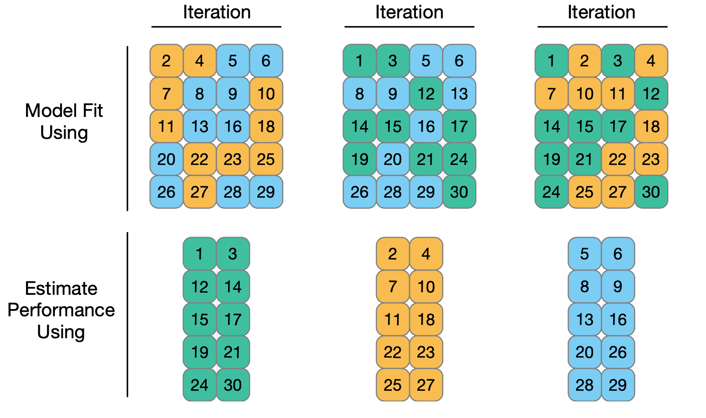

```{r}
#| include: false
#| warning: false
#| message: false

knitr::opts_chunk$set(echo = TRUE, warning = FALSE, message = FALSE,
                      fig.retina = 3, fig.align = 'center')
library(knitr)
library(tidyverse)
library(palmerpenguins)
library(cowplot)
library(moderndive)
```

::::: columns
::: {.column .center width="55%"}
{width="90%"}
:::

::: {.column .center width="45%"}
<br>

[Cross Validation]{.custom-title}

<br> <br> <br> <br> <br> 

[Grayson White]{.custom-subtitle}

[Stat 243 <br> Week 4 \| Fall 2026]{.custom-subtitle}
:::
:::::

------------------------------------------------------------------------


## Goals for today (and next time)

:::: {.columns}

::: {.column width='50%'}

::: {.nonincremental .fragment}

**Today:**

- Discuss **model selection**

- Define and discuss **resampling** and **cross-validation**

- Investigate methods of cross-validation (**k-fold cv**)

- Implement CV in **R**

:::

:::

::: {.column width='50%'}

::: {.nonincremental .fragment}

**Friday:**

-   Quiz 2 on Lab 2 material.
-   Lab 3 released. 


:::

:::

::::


# Model Selection and Validation


## Selecting a good model is central to this course

::: {.fragment .nonincremental}

We can always select a model with **tons** of predictors, interactions, and non-linear terms.

  - $R^2$ and **training error** are guaranteed to improve!

  - ...we're also likely to be **overfitting**.

  - p-values get larger, confidence intervals wider, interpretations harder, etc.

:::

::: {.fragment .nonincremental}

**Selecting a "parsimonious" model** usually lowers **test MSE**.

  - Principle of Parsimony: The simplest reasonable model is usually the best.

:::

## Selecting a good model is central to this course

**Task:** Choose model that retains only "important" predictors (i.e., $\beta_k\neq0$)

::: {.fragment .nonincremental}

**Generally good** practices:

  - If some variables are highly correlated, remove redundant ones

  - If $R^2$ is low, try adding more variables

  - If adding a polynomial term (e.g., $X^3$), include lower terms too (e.g., $X, \ X^2$)

  - If adding an interaction (e.g., $X_1X_2$), include individual terms too (e.g., $X_1, \ X_2$)

  - **Re-check diagnostics as you add/remove terms**

:::

## Selecting a good model is central to this course

**Task:** Choose model that retains only "important" predictors (i.e., $\beta_k\neq0$)

::: {.nonincremental}

**Generally bad** practices:

  - Selecting a model based on p-values (e.g., forward/backward selection)

  - All downstream inferences are invalid; p-values lose all meaning

  - This is an example of "p-hacking," which is a very big issue in applied research!

:::

::: {.fragment}

**Q:** Is there a more **general way** of selecting / validating a model?

:::

::: {.fragment}

**A:** Splitting the data into "training" and "test" sets!

:::

## Example: Fuel Economy

The `FuelEconomy` data (from the `AppliedPredictiveModeling` package) contains **Fuel Efficiency** (`FE`; in MPG) and other variables for 1107 cars and trucks from 2010

::: {.nonincremental}

- data taken from the <http://fueleconomy.gov> website

:::

::: {.fragment .nonincremental .smaller}

```{r}
#| message: false
#| warning: false
library(AppliedPredictiveModeling)
data(FuelEconomy)
glimpse(cars2010)
```

:::

## Data Exploration

Let's consider just **numeric variables**:

:::: {.columns}

::: {.column width="40%"}

::: {.fragment .nonincremental}

::: {.smaller}

```{r}
#| message: false
#| warning: false
cars2010 %>%
  select_if(is.numeric) %>%
  cor(cars2010$FE)
```

:::

Variables highly correlated with `FE`:

- **Engine Displacement** (`EngDispl`)

- **Number of Cylinders** (`NumCyl`)

:::

:::

::: {.column width="55%"}

::: {.fragment}

```{r}
#| fig-height: 6
#| echo: false
library(gridExtra)
g1 <- ggplot(cars2010, aes(x = EngDispl, y = FE))+geom_point(alpha = .5) + geom_smooth(method = "lm", se = F)+theme_bw()
g2 <- ggplot(cars2010, aes(x = NumCyl, y = FE))+geom_point(alpha = .25) + geom_smooth(method = "lm", se = F)+theme_bw()
grid.arrange(g1,g2, ncol = 1)
```

:::

:::

::::

## Collinearity

Do we want both `EngDispl` and `NumCyl` in our model for `FE`? 

- Each is strongly correlated with `FE`...


::: {.fragment .nonincremental}

  - ...thus, they might be highly collinear:

```{r}
#| out-width: "50%"
#| echo: false
cars2010 %>% ggplot(aes(x = NumCyl, y = EngDispl))+geom_point(alpha = .25)+geom_smooth(method = "lm", se = F)+theme_bw()+
  labs(title=paste0("Correlation = ",round(cor(cars2010$EngDispl, cars2010$NumCyl),3)))
```

We now have a **model selection problem:** Which variables to include?

:::

## Training and Test Sets

Let's create a 70-30 training-test split:

```{r}
#| echo: true
set.seed(1)
train_index <- sample(1:nrow(cars2010), 0.7*nrow(cars2010))
cars_train <- cars2010[train_index,]
cars_test <- cars2010[-train_index,]
```

::: {.fragment .nonincremental}

We will fit two models:

  1. `fullmod` includes all quantitative predictors
  2. `smallmod` will exclude `NumCyl`, `NumGears`, `IntakeValvePerCy`, and `VarValveLift`

:::

## Let's train!

**Training:** Fit each model to the *training data*

::: {.smaller}

```{r}
#| echo: true
fullmod <- lm(FE ~ EngDispl + NumCyl + NumGears + TransLockup + 
                TransCreeperGear + IntakeValvePerCyl + ExhaustValvesPerCyl +
                VarValveTiming + VarValveLift,
              data = cars_train)
smallmod <- lm(FE ~ EngDispl + TransLockup + TransCreeperGear +
              ExhaustValvesPerCyl + VarValveTiming,
              data = cars_train)
round(c(summary(fullmod)$r.sq, summary(smallmod)$r.sq), 3)
```

:::

`fullmod` has a *slightly* higher $R^2$, **but is it really better?**

## And now we test!

**Testing:** Calculate MSE on the *test set*

::: {.fragment .nonincremental .smaller}

```{r}
#| echo: true
fullmod_preds <- predict(fullmod, cars_test)
fullmod_mse <- mean( (cars_test$FE - fullmod_preds)^2)
fullmod_mse
```

```{r}
#| echo: true
smallmod_preds <- predict(smallmod, cars_test)
smallmod_mse <- mean( (cars_test$FE - smallmod_preds)^2)
smallmod_mse
```

:::

::: {.fragment .nonincremental}

**`smallmod` has slightly higher test MSE than `fullmod`!**

  - Could this be a fluke of our **randomly-split** test set?

:::

## Problems with Test Sets

**Q:** What are some problems with this simple Training / Test approach?

::: {.fragment .nonincremental}

- If full dataset is small, splitting into training/test further restricts sample size

  - Both training and test performance may have high variance.

:::

::: {.fragment .nonincremental}

- A single randomly-split training set may be unusual $\to$ Bias in model validation

:::

::: {.fragment .nonincremental}

- A single randomly-split test set doesn't give good estimate for amount of error.

:::

::: {.fragment .nonincremental}

How to Improve the Training/Testing Procedure:

- **Cross-Validation (CV):**

  - **Resample** *many* samples from training data and refit model in each sample.

  - Assess model accuracy by "cross-validating" to many test set

:::

# Resampling and CV

## $k$-fold Cross Validation (CV)

**$k$-fold CV:** Start by randomly partitioning data into $k$ sets, or **folds**, of size $n/k$. Then,

::: {.fragment .nonincremental}

  1) Choose one subset of size $n/k$ as the validation set

  2) Use the remaining $k-1$ subsets as the training set to build the model

  3) Calculate error rate (e.g., MSE) on the validation set

:::

::: {.fragment .nonincremental}

  4) **Repeat Steps 1-3 *for each validation set***

  5) Average the error rate computed among the $k$ validation sets

:::


## $k$-fold Cross Validation (CV)

::: {.nonincremental}

The cross-validation estimate $CV_{(k)}$ for average test MSE is:
$$
CV_{(k)} = \frac{1}{k} \sum_{i =1}^k \textrm{MSE}_i
$$
where $\textrm{MSE}_i$ is test MSE when the $i$th set, or fold, is used as validation set.

:::

::: {.fragment .nonincremental}

**Because the partitioning into folds is random, $CV_{(k)}$ still has some variability.**

  - But less than just using a single validation set!

  - To reduce variability further, $k$-fold CV can be performed multiple times, and the results of $CV_{(k)}$ themselves averaged.

:::

## Ex: 3-fold CV

Consider 30 training observations below. **Colors indicate a random fold allocation.**

```{r}
#| echo: false
#| out-width: "80%"

```

## Ex: 3-fold CV

Each iteration uses 2 of the folds to build a model, and the remaining fold to assess performance.

```{r}
#| echo: false
#| out-width: "60%"

```

Overall performance is obtained by averaging across iterations.

## CV in R: the `vfold_cv` function

We'll use the `vfold_cv` function in `rsample` to perform cross-validation.

::: {.smaller}

```{r}
#| echo: true
set.seed(927)
library(rsample)
folds_cars <- vfold_cv(cars2010, v = 10)
```

:::

This code splits the data into 10 (nearly) equal folds and stores results as a `resample` object with 2 parts:

::: {.fragment .nonincremental}

  - **`id`**, a vector with fold identifiers (i.e "Fold01", "Fold02", ... )

::: {.smaller}

```{r}
#| echo: true
folds_cars$id
```

:::

:::

::: {.fragment .nonincremental}

  - **`splits`**, an `R` list whose elements correspond to each split of the data into $k-1$ training and $1$ validation sets

:::

## CV in R: the `vfold_cv` function

Previous Code:

::: {.smaller}

```{r}
#| echo: true
#| eval: false
folds_cars <- vfold_cv(cars2010, v = 10)
```

:::

**Get Training Set for a fold:** apply `analysis` to one of the `Splits` elements.

::: {.smaller}

```{r}
#| echo: true
#| eval: false
folds_cars$splits[[1]] %>% analysis() # gets first "training set"
folds_cars$splits[[2]] %>% analysis() # gets second "training set"
```

:::

::: {.fragment .nonincremental}

**Get Corresponding Test Set:** apply `assessment` to the same `Splits` element

::: {.smaller}

```{r}
#| echo: true
#| eval: false
folds_cars$splits[[1]] %>% assessment() # observations NOT in first "training set"
folds_cars$splits[[2]] %>% assessment() # observations NOT in second "training set"
```

:::

:::

## Goal: use cross-validation to assess which model is "best"

**Steps**:

::: {.nonincremental}

1. Obtain training set

2. Fit linear model

3. Predict on assessment/validation data

4. Assess accuracy

:::

<br>

::: {.fragment}

`rsample` package did all the splitting for us (step 1)!

- But no model fitting or computing MSE (steps 2 - 4).

- How to do steps 2 - 4?

:::


## Fit the **all** the models!


## Fit the **all** the models!

We could do steps 2 -4 "by hand", e.g.,

::: {.fragment}

```{r}
full_train_1 <- lm(FE ~ EngDispl + NumCyl + NumGears + TransLockup + 
                TransCreeperGear + IntakeValvePerCyl + ExhaustValvesPerCyl +
                VarValveTiming + VarValveLift,
              data = folds_cars$splits[[1]] %>% analysis())

small_train_1 <- lm(FE ~ EngDispl + TransLockup + TransCreeperGear +
              ExhaustValvesPerCyl + VarValveTiming,
              data = folds_cars$splits[[1]] %>% analysis())

full_pred_1 <- predict(full_train_1, newdata = folds_cars$splits[[1]] %>% assessment())

small_pred_1 <- predict(small_train_1, newdata = folds_cars$splits[[1]] %>% assessment())

RMSE_full_1 <- sqrt(mean( (full_pred_1 - folds_cars$splits[[1]] %>% assessment() %>% pull(FE))^2))

RMSE_small_1 <- sqrt(mean( (small_pred_1 - folds_cars$splits[[1]] %>% assessment() %>% pull(FE))^2))

RMSE_full_1
RMSE_small_1
```


:::


-   Need to loop over all splits (1, 2, 3, ..., 10). 
-   Could write this into a `function()` or a `for()` loop and do it ourselves...


## For loop approach


```{r}
n_folds <- 10
RMSE_full <- list()
RMSE_small <- list()
for (i in 1:n_folds) {
  full_train_i <- lm(
    FE ~ EngDispl + NumCyl + NumGears + TransLockup +
      TransCreeperGear + IntakeValvePerCyl + ExhaustValvesPerCyl +
      VarValveTiming + VarValveLift,
    data = folds_cars$splits[[i]] %>% analysis()
  )
  
  small_train_i <- lm(
    FE ~ EngDispl + TransLockup + TransCreeperGear +
      ExhaustValvesPerCyl + VarValveTiming,
    data = folds_cars$splits[[i]] %>% analysis()
  )
  
  full_pred_i <- predict(full_train_i, newdata = folds_cars$splits[[i]] %>% assessment())
  
  small_pred_i <- predict(small_train_i, newdata = folds_cars$splits[[i]] %>% assessment())
  
  RMSE_full[[i]] <- sqrt(mean((full_pred_i - folds_cars$splits[[i]] %>% assessment() %>% pull(FE))^2))
  
  RMSE_small[[i]] <- sqrt(mean((small_pred_i - folds_cars$splits[[i]] %>% assessment() %>% pull(FE))^2))
}

mean(unlist(RMSE_full))
mean(unlist(RMSE_small))
```


-   Not super nice code...

-   We can use the `tidymodels`!


## `tidymodels`

:::: {.columns}

::: {.column width="25%"}


:::

::: {.column width='75%'}

-   The `tidymodels` are a collection of packages built for predictive modeling that maintain **consistent syntax** across model types.
    - e.g., fitting a linear regression model and a tree-based regression model (which we'll learn about after Fall Break) require almost identical code!
-   Lots of really thoughtful built-in functions for predictive modeling.
-   Developed and maintained by the folks at Posit, who created `RStudio` and the `tidyverse`. 
-   Simon Couch '21 worked extensively on the `tidymodels` after graduating from Reed, although now he works on a different team at Posit. 

:::

::::


## Fitting models with the `tidymodels`

Consider our `smallmod`.

:::: {.columns}

::: {.column width='50%'}

```{r}
smallmod <- lm(
  FE ~ EngDispl + TransLockup + TransCreeperGear + 
  ExhaustValvesPerCyl + VarValveTiming,
  data = cars_train
)

smallmod
```

:::

::: {.column width='50%' .fragment}

With the `tidymodels`: 

```{r}
library(tidymodels)

smallmod_tidy <- linear_reg() %>%   
  set_engine("lm")  %>%          
  fit(FE ~ EngDispl + TransLockup + TransCreeperGear +
      ExhaustValvesPerCyl + VarValveTiming, 
      data = cars_train) 

smallmod_tidy
```

:::

::::


## Fitting (many) models with the `tidymodels`

Consider our `smallmod`:

```{r}
smallmod <- lm(FE ~ EngDispl + TransLockup + TransCreeperGear +
              ExhaustValvesPerCyl + VarValveTiming,
              data = cars_train)
```

With the `tidymodels`, we can specify this model form to be fit on many different datasets: 

```{r}
# loads the tidymodels
library(tidymodels)

# specifies we'd like to do linear regression with the lm() function
lm_spec <- linear_reg() %>%   
  set_engine("lm")            

# creates a "workflow" to be used on many datasets
# NOTICE: no data is supplied
smallmod_wf <- workflow() %>%
  add_model(lm_spec) %>%
  add_formula(FE ~ EngDispl + TransLockup + TransCreeperGear +
              ExhaustValvesPerCyl + VarValveTiming) 
```


## Get Results

`fit_resamples()` fits the workflow on each training set and evaluates it on the matching assessment set.


```{r}
smallmod_res <- fit_resamples(
  smallmod_wf,
  resamples = folds_cars,
  metrics = metric_set(rmse)
)
```

::: {.fragment}

`collect_metrics()` collects the metrics calculated on each test set.

```{r}
collect_metrics(smallmod_res, summarize = FALSE) 
```

:::


## Get Results

`fit_resamples()` fits the workflow on each training set and evaluates it on the matching assessment set.


```{r}
smallmod_res <- fit_resamples(
  smallmod_wf,
  resamples = folds_cars,
  metrics = metric_set(rmse)
)
```

`collect_metrics()` collects the metrics calculated on each test set.

```{r}
collect_metrics(smallmod_res) 
```


## Comparing Models

Now, we can run the same code for our `fullmod`:

```{r}
fullmod_wf <- workflow() %>%
  add_model(lm_spec) %>%
  add_formula(FE ~ EngDispl + NumCyl + NumGears + TransLockup + 
                TransCreeperGear + IntakeValvePerCyl + ExhaustValvesPerCyl +
                VarValveTiming + VarValveLift) 

fullmod_res <- fit_resamples(
  fullmod_wf,
  resamples = folds_cars,
  metrics = metric_set(rmse)
)

collect_metrics(fullmod_res) 
```

<br>

::: {.nonincremental}

- Note that we are using the same `lm_spec` as before.

:::


## Comparing Models


Which model is best?


```{r}
collect_metrics(fullmod_res) 
collect_metrics(smallmod_res) 
```


# How to choose the number of folds, $k$


## Selecting the Number of Folds, $k$

::: {.nonincremental}

1. What's the smallest value $k$ can be in $k$-fold CV? Largest?
    - **A:** [$K\in\{2,3,\dots,n\}$]{.fragment}

2. What are some pros and cons of small $k$?
    - **Pro:** [Easier computation (fewer models to train), but...]{.fragment}
    - **Con:** [Training data is small: doesn't reflect true size of training data]{.fragment}

3. What are some pros and cons of large $k$?
    - **Con:** [Harder computation (many models to train), but...]{.fragment}
    - **Pro:** [Training data is large: reflect true size of training data]{.fragment}

:::


## Selecting the Number of Folds, $k$

$k = 10$ is a common 'rule of thumb'. But choosing $k$ depends on your data and context!!

- If $n$ is small, $k = 10+$ is generally a good choice,
- If $n$ is large and computation time is long, $k = 5$ typically does fine. 


## Next time: 

-   Quiz on Lab 2 content.
-   Lab 3 released.


